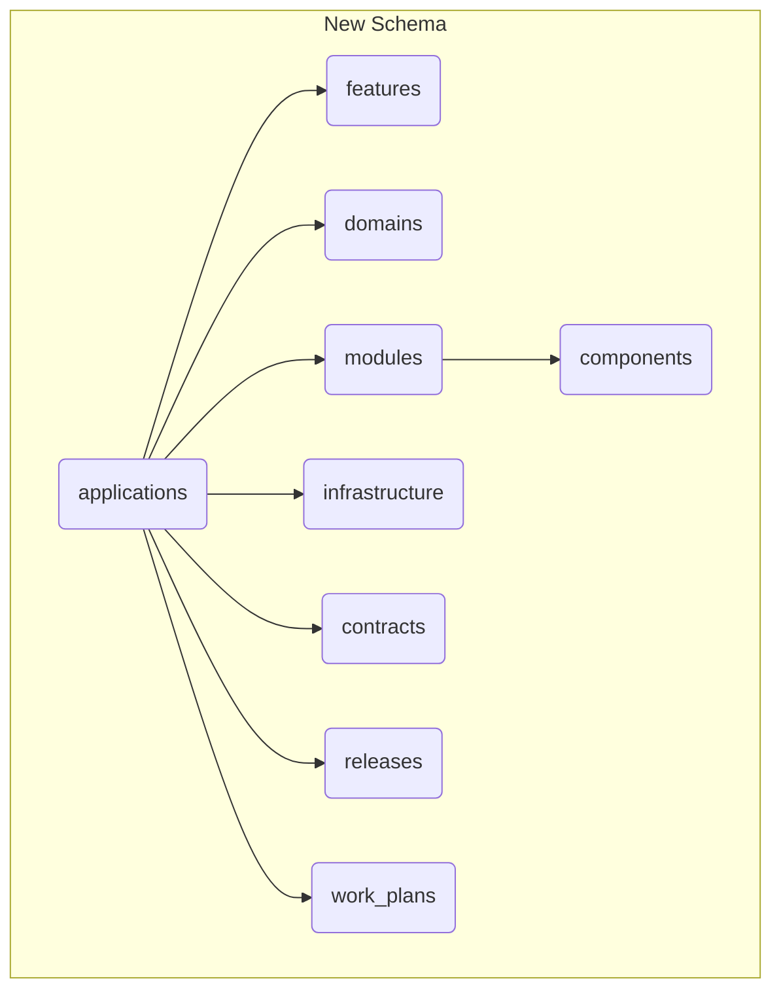
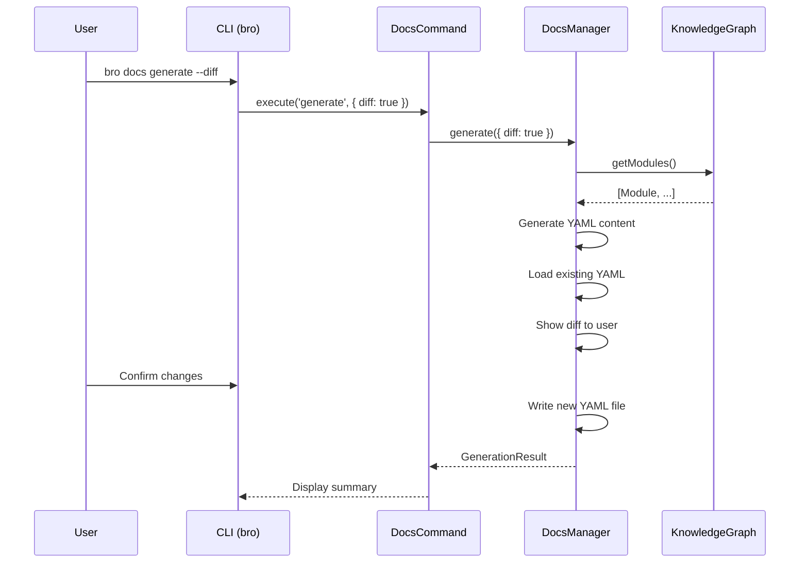

# Project Plan: Comprehensive Document Generation

This plan is divided into four phases, starting with the foundational data layer and culminating in the user-facing CLI command.

---

### **Phase 1: Knowledge Graph Expansion**

This phase establishes the necessary database schema and data access layer to support all 9 document types. We will follow the existing pattern of specific entity tables synchronized with the generic knowledge graph.

**1.1. Database Schema Extension (`schema.sql`)**

We will add new tables for the required concepts.



**New Tables to Add:**

- `domains`
- `modules` (with fields for `type`, `description`, `domain`, `interface`, `state`)
- `components` (linked to `modules`)
- `screens` (linked to `modules`)
- `behaviors` (linked to `modules`)
- `flows` (linked to `modules`)
- `things` (linked to `modules`)
- `infrastructure`
- `contracts`
- `releases`
- `work_plans`

**1.2. Create Repositories**

For each new table, we will create a corresponding repository class in `packages/core/src/repositories/`.

- `DomainRepository.ts` (already exists, will be updated)
- `ModuleRepository.ts`
- `ComponentRepository.ts`
- `InfrastructureRepository.ts`
- `ContractRepository.ts`
- `ReleaseRepository.ts`
- `WorkPlanRepository.ts`
- And so on for all new entities...

**1.3. Enhance `KnowledgeGraph` Class**

We will add methods to `packages/core/src/knowledgeGraph/KnowledgeGraph.ts` to provide a clean API for the document generators.

**New `KnowledgeGraph` methods:**

- `getDomains(): Promise<Domain[]>`
- `getModules(): Promise<Module[]>`
- `getComponentsByModule(moduleId): Promise<Component[]>`
- `getFeatures(): Promise<Feature[]>`
- ... and so on for all document types.

---

### **Phase 2: Core Generation & Validation Logic**

This phase focuses on creating the specific logic for each document type and enhancing the existing generation engine.

**2.1. Create Zod Schemas**

In `packages/core/src/yamlgen/`, we will create a file, e.g., `schemas.ts`, to house Zod schemas for validating each of the 9 YAML documents. This ensures type safety and structural integrity.

**2.2. Implement Document Generators**

For each document type, we will create a generator class that implements the `DocumentGenerator` interface.

- `ApplicationYAMLGenerator.ts` (exists, can be used as a template)
- `DomainsYAMLGenerator.ts`
- `FeaturesYAMLGenerator.ts`
- `ModulesYAMLGenerator.ts`
- ... and so on for all 9 types.

**2.3. Enhance `YAMLGenerationEngine`**

The existing engine in `packages/core/src/yamlgen/index.ts` will be refactored and enhanced to support the new requirements. We will rename it to `DocsManager` or similar to reflect its expanded role.

**New `DocsManager` features:**

- **Incremental Generation:** Compare timestamps or hashes to detect changes.
- **Comment/Custom Section Preservation:** Use a library like `comment-json` (already a dependency) or a custom parser to read the existing YAML, extract comments, and re-apply them to the newly generated document.
- **Diff Preview:** Use the `diff` library to generate and display a colorized diff before writing changes.
- **Backup:** Before overwriting a file, create a backup (e.g., `application.yaml.bak`).

---

### **Phase 3: CLI Command Implementation**

This phase wires everything into a new `bro docs` command.

**3.1. Create `DocsCommand.ts`**

A new file, `packages/cli/src/commands/DocsCommand.ts`, will be created. It will contain the `DocsCommand` class with the main `execute` method.

**3.2. Implement Command Logic**

The `execute` method will parse the action (`generate`, `validate`, `status`) and options.



**Command Options to Implement:**

- `--only <type>`: Filter which documents to generate.
- `--force`: Generate all documents regardless of changes.
- `--dry-run`: Run the full generation process without writing files.
- `--diff`: Show a diff preview before writing.
- `--backup`: Create backups of existing documents.
- `--parallel`: Use `Promise.all` to generate documents concurrently.

**3.3. Register the Command**

Finally, we will register the new command in `packages/cli/src/index.ts`.

---

### **Phase 4: Dependencies & Finalization**

**4.1. Update `package.json`**

We will add the new dependencies to `package.json`:

```json
"dependencies": {
  "diff": "^5.0.0",
  "fast-glob": "^3.0.0",
  // ... existing dependencies
}
```

**4.2. Testing**

Unit and integration tests will be crucial, especially for:

- The `KnowledgeGraph` methods.
- The comment preservation logic.
- The diff generation.
- The CLI command options.
