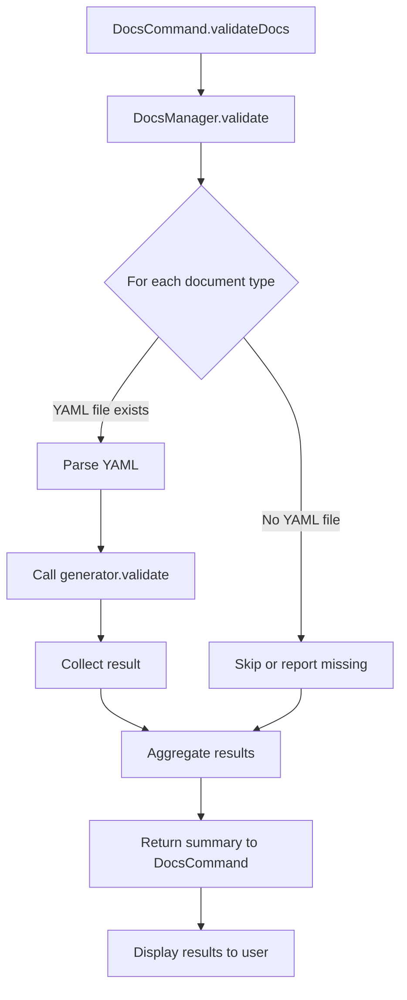

# Plan: Implement Document Validation Logic in DocsCommand

## 1. Extend DocsManager with a `validate` Method

**Purpose:** Validate all YAML documents in the docs directory using the appropriate generator and schema.

**Steps:**

- For each registered document type:
  - Load the corresponding YAML file from disk.
  - Parse the YAML into a JS object.
  - Call the generator's `validate` method.
  - Collect results (valid/invalid, errors).
- Return a summary of validation results.

## 2. Update DocsCommand.validateDocs

**Purpose:** Use the new DocsManager.validate method and display results to the user.

**Steps:**

- Call `this.docsManager.validate()`.
- Print a summary table (type, status, errors if any).

## 3. Create Automated Tests

**Location:** `packages/cli/src/__tests__/DocsCommand.test.ts`

**Steps:**

- Set up a temporary docs directory with:
  - At least one valid YAML file for a known type.
  - At least one invalid YAML file for a known type.
- Instantiate DocsCommand with a mock or real DocsManager pointing to the temp directory.
- Call `validateDocs` and assert that:
  - Valid files are reported as valid.
  - Invalid files are reported as invalid, with error messages.

## 4. (Optional) CLI Output Improvements

- Use color coding and clear formatting for validation results.

---

## Mermaid Diagram: Validation Flow

---

## File Changes Overview

- [`packages/core/src/yamlgen/index.ts`](packages/core/src/yamlgen/index.ts): Add `validate` method to DocsManager.
- [`packages/cli/src/commands/DocsCommand.ts`](packages/cli/src/commands/DocsCommand.ts): Implement validation logic in `validateDocs`.
- `packages/cli/src/__tests__/DocsCommand.test.ts`: New test file for validation logic.
