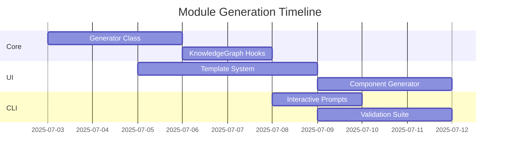

# Module Generation Implementation Plan

## Phase 1: Core Generation Infrastructure

**1. ModuleGenerator Class**

- Location: `packages/core/src/generation/ModuleGenerator.ts`
- Responsibilities:
  - Domain analysis and module type inference
  - Thing/Behavior generation from NLP extraction
  - Flow creation between components
  - Integration with KnowledgeGraph

**2. KnowledgeGraph Extensions**

- New methods in `KnowledgeGraph.ts`:
  ```typescript
  async generateModules(options: GenerationOptions): Promise<Module[]>
  async getGenerationContext(domainId: string): Promise<GenerationContext>
  ```

## Phase 2: UI Component Generation

**1. Template System**

- Directory: `packages/core/src/templates/ui/`
- Template types:
  - React components
  - State management (Nanostores)
  - Storybook stories
  - Jest tests

**2. Component Generator**

- Class: `ComponentGenerator.ts`
- Features:
  - JSX template generation
  - Prop type inference
  - Storybook integration

## Phase 3: Interactive Customization

**CLI Command Implementation**

- New command: `GenerateCommand.ts`
- Features:
  ```typescript
  inquirer.prompt({
    type: 'checkbox',
    name: 'overrides',
    message: 'Select elements to customize:',
    choices: ['Things', 'Behaviors', 'Flows', 'Components'],
  });
  ```

## Validation & Testing Strategy

**1. Test Cases**

- File: `ModuleGenerator.test.ts`
- Coverage:
  - Module type inference accuracy
  - Schema validation
  - Relationship integrity

**2. Snapshot Testing**

```typescript
expect(module).toMatchInlineSnapshot(`
  Object {
    "behaviors": Array [
      Object {
        "description": "User registration flow",
        "name": "register_user",
      },
    ],
    "name": "user_management",
  }
`);
```

## Implementation Roadmap


