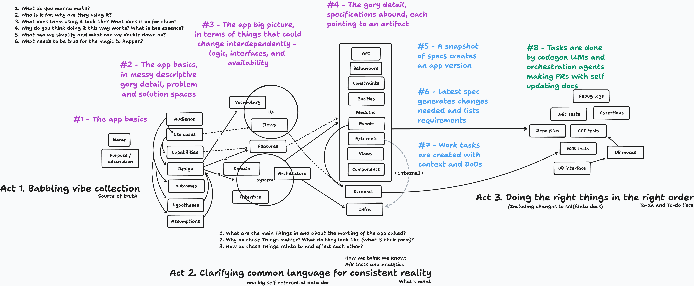

# Bropilot

**Think through your app, together.**

Bropilot is a conversational app architect that helps you specify your software before writing a single line of code. Describe your idea in plain language; Bropilot listens, asks clarifying questions, and builds a versioned knowledge graph of your application spec in real time.

No more scattered notes, forgotten decisions, or specs that drift from reality. Every node traces back to your exact words.



## Why Bropilot?

Traditional spec docs are static artifacts that rot. Bropilot treats your spec as a living knowledge graph:

- **Docs as code**: Your spec is a queryable, versioned data structure—not a Word doc
- **Full traceability**: Every node links back to the conversation that created it
- **Progressive refinement**: Start with the big picture, drill down as understanding grows
- **Visible thinking**: Watch the graph evolve as you talk through your idea
- **Multi-stage input processing**: Complex inputs go through intent classification, entity resolution, change planning, and validation before execution
- **Validation with 12 rules**: Catches errors, warnings, and suggestions (duplicate nodes, orphans, missing connections, unbalanced spaces)
- **Undo/redo support**: Full change history with the ability to undo/redo any graph operation
- **Completeness scoring**: Track how complete your spec is across all four spaces
- **AI suggestions**: Context-aware suggestions for improving your graph (orphan nodes, missing flows, implicit concepts)
- **Keyboard shortcuts**: Navigate the graph efficiently with arrow keys, search with `/`, undo with Cmd+Z
- **Bootstrap demo**: Load Bropilot's own self-specification as a demo to explore the system

## Quick Start

```bash
# Clone and set up
git clone https://github.com/yourorg/bropilot && cd bropilot
npm run setup

# Run locally (needs OpenRouter API key)
cp .env.example .env
# Edit .env with your OPENROUTER_API_KEY
npm run dev

# Open http://localhost:8787
```

## How It Works

```
                            ┌─────────────────────────────────────────────────┐
                            │                    BROPILOT                      │
                            └─────────────────────────────────────────────────┘
                                                    │
           ┌────────────────────────────────────────┼────────────────────────────────────────┐
           │                                        │                                        │
           ▼                                        ▼                                        ▼
    ┌─────────────┐                        ┌─────────────┐                          ┌─────────────┐
    │   CHAT UI   │                        │   EXPLORER  │                          │ GRAPH VIEW  │
    │             │◄──────────────────────►│    AGENT    │──────────────────────────►│             │
    │  (Svelte 5) │      SSE stream        │   (Flue)    │      graph mutations      │  (xyflow)   │
    └─────────────┘                        └─────────────┘                          └─────────────┘
                                                    │
                              ┌──────────────────────┼──────────────────────┐
                              │ process_complex_input│  direct tools        │
                              ▼                      ▼                      │
                    ┌─────────────────────────────────────┐                 │
                    │      INPUT PROCESSING PIPELINE      │                 │
                    │  ┌───────────────────────────────┐  │                 │
                    │  │ 1. Intent Classification      │  │                 │
                    │  │ 2. Entity Resolution          │  │                 │
                    │  │ 3. Change Planning            │  │                 │
                    │  │ 4. Validation (12 rules)      │  │                 │
                    │  │ 5. Execution                  │  │                 │
                    │  └───────────────────────────────┘  │                 │
                    └─────────────────────────────────────┘                 │
                                                    │                      │
                                                    ▼                      ▼
                                           ┌─────────────────┐
                                           │  GENOME STORE   │
                                           │ (SQLite in DO)  │
                                           │                 │
                                           │  nodes / edges  │
                                           │  changes        │
                                           │  snapshots      │
                                           └─────────────────┘
```

1. **You talk**: Describe your app idea in the chat pane
2. **Agent listens**: The explorer agent extracts structure as you speak, calling tools to add nodes and edges
3. **Graph grows**: The knowledge graph updates live, visualized with automatic layout
4. **Traceability**: Every node stores the exact quote from your conversation that created it

## The Knowledge Graph

### Four Spaces

Nodes are organized into four conceptual spaces, from abstract to concrete:

| Space | Purpose | Node Kinds |
|-------|---------|------------|
| **Basics** | What is this app? | `name`, `purpose`, `capability` |
| **Problem** | Who uses it and why? | `persona`, `usecase`, `flow`, `screen`, `constraint`, `assumption`, `requirement` |
| **Solution** | How does it work? | `entity`, `relationship`, `module`, `component`, `interface`, `api`, `event`, `state`, `behaviour`, `logic` |
| **Crosscutting** | What supports it? | `repository`, `tests`, `observability`, `external`, `design` |

### Node Kinds

#### Basics (Act 1)
- **name** — The app's name (singular)
- **purpose** — Why it exists (singular)
- **capability** — A high-level thing it can do

#### Problem Space
- **persona** — A type of user (e.g., "Admin", "Guest")
- **usecase** — A goal a persona wants to achieve
- **flow** — A sequence of steps to accomplish something
- **screen** — A UI surface the user interacts with
- **constraint** — A hard requirement or limitation
- **assumption** — Something you're taking as true (for now)
- **requirement** — A specific must-have feature or behavior

#### Solution Space
- **entity** — A domain object (e.g., "User", "Order")
- **relationship** — How entities relate
- **module** — A logical grouping of functionality
- **component** — A reusable UI or backend piece
- **interface** — A contract between modules
- **api** — An endpoint or service boundary
- **event** — Something that happens in the system
- **state** — A condition the system can be in
- **behaviour** — How something acts under certain conditions
- **logic** — Business rules or algorithms

#### Crosscutting
- **repository** — Where code lives
- **tests** — Test strategy or specific test cases
- **observability** — Logging, metrics, alerting
- **external** — Third-party services or integrations
- **design** — Visual design decisions or assets

### Edge Types

Edges connect nodes to show relationships:

| Edge Type | Meaning | Example |
|-----------|---------|---------|
| `has` | Ownership/composition | persona *has* usecase |
| `uses` | Dependency | flow *uses* api |
| `triggers` | Causation | event *triggers* behaviour |
| `implements` | Realization | component *implements* interface |
| `depends_on` | Requires | module *depends_on* external |
| `extends` | Inheritance/specialization | persona *extends* persona |
| `contains` | Nesting | screen *contains* component |
| `references` | Association | entity *references* entity |

## Example Conversation

```
You: I want to build a recipe sharing app where users can save and 
     organize their favorite recipes.

Bropilot: Great, let me capture that.
          [add_node: name "Recipe Sharing App"]
          [add_node: purpose "Help users save and organize favorite recipes"]
          
          Who are your main users? Just home cooks, or also professional chefs?

You: Mostly home cooks. But I also want food bloggers to be able to 
     share their recipes publicly.

Bropilot: [add_node: persona "Home Cook"]
          [add_node: persona "Food Blogger"]  
          [add_edge: "Food Blogger" extends "Home Cook"]
          
          So food bloggers are home cooks with extra publishing abilities.
          What's the key difference in what they can do?

You: Bloggers can make recipes public and get follower counts. 
     Regular users keep everything private.

Bropilot: [add_node: capability "Public Recipe Publishing"]
          [add_node: capability "Follower System"]
          [add_edge: "Food Blogger" has "Public Recipe Publishing"]
          [add_node: constraint "Home Cook recipes are private by default"]
          
          Got it. What about the recipe itself—what information 
          does a recipe need to contain?
```

### Validation & Suggestions

As you build, Bropilot continuously validates your graph:

```
Bropilot: [validate_graph]
          
          Warnings:
          - Use case "Save Recipe" is not connected to any persona
          - Entity "Recipe" has no relationships to other entities
          
          Suggestions:
          - "Save Recipe" has no user flow — what steps does the user take?
          - You have 3 entities but no relationships — how do they connect?
```

### Completeness Scoring

Track your progress with completeness scores per space:

```
Bropilot: [get_completeness]
          
          Overall: 45%
          - Basics: 30/30 (name + purpose defined)
          - Problem: 15/35 (personas defined, need flows)
          - Solution: 0/25 (no entities yet)
          - Crosscutting: 0/10 (no assumptions captured)
          
          Top suggestion: Walk through a typical user journey step by step
```

As you continue, the graph grows:

```
                    ┌─────────────────┐
                    │ Recipe Sharing  │
                    │      App        │
                    │    (name)       │
                    └────────┬────────┘
                             │ has
              ┌──────────────┼──────────────┐
              ▼              ▼              ▼
       ┌──────────┐   ┌──────────┐   ┌──────────┐
       │Home Cook │   │  Food    │   │ Private  │
       │(persona) │◄──│ Blogger  │   │ Default  │
       └──────────┘   │(persona) │   │(constrt) │
                      └────┬─────┘   └──────────┘
                           │ has
                      ┌────┴─────┐
                      ▼          ▼
               ┌──────────┐ ┌──────────┐
               │ Public   │ │Followers │
               │Publishing│ │ System   │
               │(capabil) │ │(capabil) │
               └──────────┘ └──────────┘
```

## Keyboard Shortcuts

Press `?` in the app to see all shortcuts.

| Category | Shortcut | Action |
|----------|----------|--------|
| **Global** | `Cmd+Z` | Undo last change |
| | `Cmd+Shift+Z` | Redo last undone change |
| | `/` or `Cmd+K` | Focus search input |
| | `Escape` | Clear selection, close modals |
| | `?` | Show keyboard help |
| **Graph** | Arrow keys | Navigate between connected nodes |
| | `Enter` | Expand/collapse selected node |
| | `Space` | Open inspector for selected node |
| | `f` | Fit graph to view |
| | `1-4` | Toggle space visibility |
| **Chat** | `Enter` | Send message |
| | `Escape` | Blur input, focus graph |

## Project Structure

```
bropilot/
├── src/
│   ├── app.ts                  # Hono server, mounts Flue routes
│   ├── agents/
│   │   └── explorer.ts         # The conversational agent
│   ├── workflows/
│   │   └── process-input.ts    # Multi-stage input processing pipeline
│   ├── engine/
│   │   └── input-processor.ts  # Intent classification, entity resolution, change planning
│   └── genome/
│       ├── types.ts            # Node kinds, edge types, interfaces
│       ├── tools.ts            # Graph manipulation tools (20+ tools)
│       ├── store.ts            # SQLite persistence, undo/redo, snapshots
│       ├── validation.ts       # 12 validation rules (errors, warnings, suggestions)
│       └── prompt.ts           # System prompt for the explorer agent
├── web/
│   ├── src/
│   │   ├── App.svelte          # Main layout with keyboard handling
│   │   ├── components/
│   │   │   ├── ChatPane.svelte      # Conversation UI
│   │   │   ├── GraphCanvas.svelte   # xyflow graph + undo/redo controls
│   │   │   ├── GraphNode.svelte     # Custom node renderer
│   │   │   ├── NodeInspector.svelte # Selected node details
│   │   │   └── KeyboardHelp.svelte  # Keyboard shortcuts modal
│   │   └── lib/
│   │       ├── api.svelte.ts    # SSE streaming to backend
│   │       ├── stores.svelte.ts # Svelte 5 reactive state (incl. undo/redo)
│   │       └── types.ts         # Shared type definitions
│   └── package.json
├── fixtures/
│   └── bropilot-bootstrap.json  # Bropilot self-spec demo data
├── recipes/                     # Recipe definitions (node schemas, etc.)
├── flue.config.ts               # Flue framework configuration
├── wrangler.jsonc               # Cloudflare Workers config
└── package.json
```

## Development

```bash
# Install dependencies
npm run setup

# Run development server
npm run dev          # Backend at :8787

# Run frontend dev server (hot reload)
npm run dev:web      # Vite at :5173, proxies to :8787

# Type checking
npm run typecheck    # Both backend and frontend

# Build for production
npm run build        # Build Flue + SPA
npm run build:web    # Build SPA only

# Deploy to Cloudflare
npm run deploy
```

## Architecture

### Backend

- **Flue 0.11.1** — Agent runtime framework (pinned version)
- **Hono** — HTTP server
- **Cloudflare Workers** — Serverless deployment
- **Durable Objects + SQLite** — Persistent graph storage

### Frontend

- **Svelte 5** — UI framework with new runes reactivity
- **xyflow** — Graph visualization with automatic dagre layout
- **SSE streaming** — Real-time updates as agent works

### The Explorer Agent

The explorer agent (`src/agents/explorer.ts`) is the heart of Bropilot. It:

1. Receives user messages via SSE stream
2. Calls graph tools (`add_node`, `add_edge`, etc.) as it thinks
3. Asks clarifying questions to fill gaps
4. Keeps the conversation moving toward a complete spec

The agent's system prompt (`src/genome/prompt.ts`) guides it to:
- Capture entities immediately as they emerge
- Always quote the user's exact words as source references
- Build incrementally: basics -> problem -> solution
- Surface implicit decisions explicitly

## Configuration

### Environment Variables

```bash
# Required for live mode
OPENROUTER_API_KEY=sk-or-v1-...
```

### Cloudflare Setup

The `wrangler.jsonc` configures:
- Durable Object classes for session and graph storage
- SQLite migrations for schema versioning

## License

MIT
