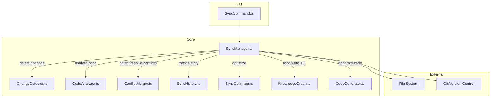

# Bidirectional Sync System: Implementation Plan

## Scope & Design Choices

- **Entity Types:** Sync supports all entity types: things, behaviors, flows, features, etc.
- **Conflict Resolution:** Defaults to CLI prompts per conflict, with an option for a batch/strategy flag (e.g., always use code/KG/merge).
- **Sync History:** Tracked in both git (for code) and a separate file (for KG and metadata).
- **Selective Sync:** Supports both modules and individual entities.

---

## 1. Architecture Overview

---

## 2. Core Features & Steps

### A. Sync Status (`bro sync status`)

- Extract all entity types from code and KG.
- Use `ChangeDetector` for content-based diff.
- Use `ConflictMerger` for real conflict detection.
- Summarize and print results in CLI.

### B. Pull (`bro sync pull`)

- Detect code changes for all entity types.
- Show changes (support `--dry-run`).
- If not dry-run, apply changes to KG (with confirmation unless `--force`).
- Detect and prompt for conflicts (CLI prompt or batch flag).
- Record operation in both git and sync history file.

### C. Push (`bro sync push`)

- Detect KG changes for all entity types.
- Show changes (support `--dry-run`).
- If not dry-run, use `CodeGenerator` to update code.
- Detect and prompt for conflicts (CLI prompt or batch flag).
- Record operation in both git and sync history file.

### D. Conflict Detection & Resolution

- Use three-way merge (base, code, KG).
- CLI prompts for each conflict by default; batch/strategy flag for automation.
- Allow manual, use-code, use-KG, or merge strategies.

### E. Sync History & Rollback

- Record each sync in git and a separate history file (with metadata).
- `showHistory` lists previous syncs.
- `rollback` restores code (via git) and KG (via snapshot in history file).

### F. Selective Sync

- All sync operations accept `--modules` and/or entity filters.
- Only analyze/apply changes for specified modules/entities.

### G. Dry-Run Mode

- All sync operations support `--dry-run`.
- Print what would change, but do not modify code/KG.

### H. Performance Optimization

- Use file watchers (chokidar) for incremental sync.
- Use checksums to skip unchanged files.
- Parallelize analysis (chunk files).
- Cache results between runs.

### I. Version Control Integration

- On each sync, record git commit hash.
- Use git diff for base version in three-way merge.
- Use git for rollback (reset code), and restore KG from history file.

---

## 3. Implementation Phases

1. **Core Sync Logic:** Implement content-based sync for all entity types.
2. **Conflict Detection & Resolution:** Three-way merge, CLI prompts, batch flag.
3. **History & Rollback:** Dual tracking (git + file), rollback logic.
4. **Selective Sync & Dry-Run:** Filtering and dry-run for all actions.
5. **Performance:** File watching, checksums, parallelism.
6. **UX & CLI Polish:** Output, help, error handling, docs.

---

## 4. CLI Flows

- `bro sync status`
- `bro sync pull --dry-run --modules user,auth`
- `bro sync push --force --entities User,Order`
- `bro sync pull --resolve`
- `bro sync history`
- `bro sync rollback --to 2024-07-01T12:00:00Z`

---

## Notes

- All entity types are supported.
- Conflict resolution is interactive by default, with batch/strategy override.
- Sync history is robust and dual-tracked.
- Selective sync is flexible.
- Performance and UX are first-class concerns.
