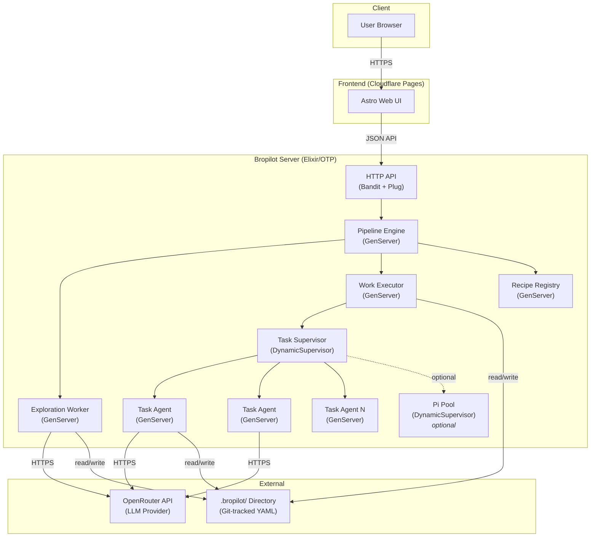
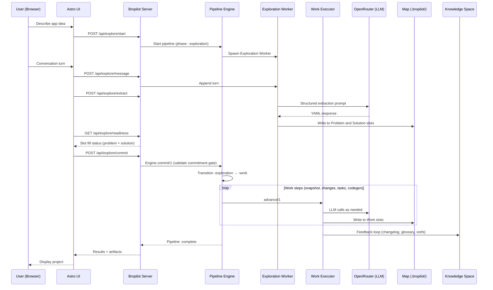

# Bropilot Architecture

> An app that makes apps.

Bropilot is an Elixir/OTP system that transforms a high-level problem description into a working web application through a structured, LLM-powered pipeline. It enforces a **three-tier authority model** — immutable Spaces, superuser-defined Recipes, and user-filled Maps — so that every generated project follows a rigorous thinking framework regardless of the recipe or LLM provider in use.

---

## Table of Contents

- [System Overview](#system-overview)
- [The Three-Tier Authority Model](#the-three-tier-authority-model)
- [The 5 Immutable Spaces](#the-5-immutable-spaces)
- [Architecture Diagram](#architecture-diagram)
- [Data Flow](#data-flow)
- [The Pipeline: Exploration → Commit → Work](#the-pipeline-exploration--commit--work)
- [Recipe System](#recipe-system)
- [LLM Integration](#llm-integration)
- [Task System & Coding Agents](#task-system--coding-agents)
- [Deployment Architecture](#deployment-architecture)
- [Technology Choices](#technology-choices)
- [Directory Structure](#directory-structure)

---

## System Overview

Bropilot moves a project through a two-phase pipeline with a single commitment gate:

1. **Exploration phase**: Problem and Solution are filled concurrently through a freeform, lens-guided conversation. There are no internal gates — the user jumps between problem-framing and solution-sketching as the idea takes shape.
2. **Commitment gate**: A single validation checkpoint. Both Problem and Solution must have their required slots filled before transitioning to Work.
3. **Work phase**: Sequential work steps (snapshot → changes → tasks → codegen) that diff the solution, generate tasks, and dispatch supervised coding agents. No inter-step gates.

Measurement and Knowledge are cross-cutting spaces that accumulate automatically — Measurement during Work execution, Knowledge as a derivation of Measurement plus Solution hypotheses.

Every piece of data produced flows through the immutable Space framework and is persisted in a `.bropilot/` directory that is committed to the project's git repository — the single source of truth.

---

## The Three-Tier Authority Model

```
┌─────────────────────────────────────────────┐
│  Tier 1: SPACES (Immutable)                 │
│  Defined in Bropilot core. Cannot be        │
│  added, removed, or renamed by anyone.      │
│  5 fundamental thinking categories.         │
├─────────────────────────────────────────────┤
│  Tier 2: RECIPE (Superuser)                 │
│  Pipeline steps, schemas, prompts, and      │
│  validations. Defines HOW to traverse the   │
│  spaces. Publishable and installable.       │
├─────────────────────────────────────────────┤
│  Tier 3: MAP (User)                         │
│  Project-specific data filled by walking    │
│  through the recipe pipeline. YAML files    │
│  organized by space.                        │
└─────────────────────────────────────────────┘
```

- **Spaces** are hardcoded in `lib/bropilot/spaces/spaces.ex` and locked via `spaces.lock`.
- **Recipes** live in `priv/recipes/<name>/` and are copied to `.bropilot/recipe/` on init.
- **Maps** are generated at `.bropilot/map/` with subdirectories per space.

---

## The 5 Immutable Spaces

| Space | Governs | Cross-cutting? | Required Slots |
|-------|---------|:--------------:|----------------|
| **Problem** | Why we're building. The mess before the solution. | No | `audience`, `problem`, `context`, `assumptions`, `hypotheses` |
| **Solution** | What the thing is. The model, the language, the architecture. | No | `vocabulary`, `domain/`, `flows/`, `architecture/`, `specs/` |
| **Work** | How and when things get built. | No | `versions/` |
| **Measurement** | Verification across all other spaces. | Yes | `validation/` |
| **Knowledge** | The evolving shared understanding. Feeds back into all spaces. | Yes | `glossary`, `decisions/`, `changelog`, `xrefs` |

**Primary spaces** Problem and Solution are explored together during the Exploration phase. **Work** is entered only after the commit gate. **Cross-cutting spaces** (Measurement, Knowledge) accumulate automatically — Measurement during Work execution, Knowledge derived from Measurement plus Solution hypotheses.

### Gate Validation

The pipeline has exactly **one gate**: the commitment gate that transitions the engine from Exploration to Work. It validates that both the Problem and Solution spaces have their required slots filled before any work begins. No other transitions are gated.

```elixir
# lib/bropilot/spaces/spaces.ex
Spaces.validate_commitment_gate(map_dir)
# => :ok | {:error, {:unfilled_slots, %{problem: [...], solution: [...]}}}
```

---

## Architecture Diagram



---

## Data Flow

A request flows through the system in this order:



### The Self-Referential Feedback Loop

After each coding task completes, the `Bropilot.Pipeline.Feedback` module updates the Knowledge Space:

1. **Changelog** (`knowledge/changelog.yaml`) — what was built, when, from which task
2. **Cross-references** (`knowledge/xrefs.yaml`) — term → spec → artifact path mappings
3. **Glossary** (`knowledge/glossary.yaml`) — new terms discovered during processing

This knowledge feeds back into future LLM prompts, creating a self-improving context loop.

---

## The Pipeline: Exploration → Commit → Work

The pipeline engine (`lib/bropilot/pipeline/engine.ex`) is a state machine with three phases: `:exploration`, `:work`, and `:complete`. Persistence format is `{phase, work_step_index, completed_steps}`.

### Exploration Phase (Problem + Solution, concurrent)

A single `Bropilot.Pipeline.Exploration.Worker` GenServer drives a freeform conversation. The recipe provides optional **lenses** — prompt templates targeting specific Problem and/or Solution slots — but the user is never forced to visit them in order. `Exploration.Extractor` coordinates the existing `Act1.Extractor` and `Act2.Extractor` pure-function modules to pull slot values out of each conversation turn and write them to both spaces concurrently.

In `:exploration`, `Engine.advance/1` returns `{:error, :use_commit}` — the only way out is through the commit gate.

**API surface** (all under `/api/explore/`):

| Endpoint | Purpose |
|----------|---------|
| `POST /api/explore/start` | Start the worker (`{mode: "mock" | "llm"}`) |
| `POST /api/explore/message` | Submit a conversation message |
| `POST /api/explore/buffer` | Additive STT/text buffer |
| `POST /api/explore/extract` | Trigger extraction across both spaces |
| `GET  /api/explore/readiness` | Slot fill status for Problem and Solution |
| `GET  /api/explore/lenses` | Optional UI lens prompts from recipe |
| `POST /api/explore/auto` | Toggle auto-extraction |
| `POST /api/explore/commit` | The single commitment gate |

### Commitment Gate

`Engine.commit/1` invokes `Spaces.validate_commitment_gate/1`, which checks that every required Problem slot **and** every required Solution slot is filled. On success, the engine transitions `:exploration → :work`. On failure, it returns the unfilled slots per space and stays in exploration.

### Work Phase

Sequential work steps with no inter-step gates. `Engine.advance/1` walks them in order; the phase ends in `:complete`.

| Step | Name | What It Does |
|------|------|-------------|
| **1** | Snapshot | Takes a hash of the current Solution state. Creates `versions/v{N}/snapshot.yaml`. |
| **2** | Changes | Diffs against the previous snapshot. Identifies added, modified, and removed specs. |
| **3** | Tasks | Generates one task per change with title, description, definition of done, dependencies, and priority. Topologically sorts by dependency. |
| **4** | Codegen | Dispatches tasks as supervised `Task.Agent` GenServers. Each agent builds a prompt from task context + codegen template and sends it to the LLM. |

**Cross-cutting accumulation**: Measurement accrues automatically during Work from task results and validation output. Knowledge is derived from Measurement plus Solution hypotheses (changelog, xrefs, glossary).

---

## Recipe System

A recipe is a directory containing:

```
priv/recipes/webapp/
├── recipe.yaml          # Metadata: name, version, description
├── pipeline.yaml        # phases: exploration (lenses, commit_gate) + work (steps)
├── prompts/
│   ├── exploration-lenses.md
│   ├── big-picture.md
│   ├── specs.md
│   └── codegen.md
└── schemas/
    ├── problem/
    │   └── *.schema.yaml
    └── solution/
        └── *.schema.yaml
```

### pipeline.yaml structure

```yaml
phases:
  exploration:
    lenses:
      - id: basics
        name: The Basics
        prompt: "Tell me about the app you want to build."
        targets:
          problem: [name, purpose, problem, context]
          solution: []
      - id: big_picture
        name: Big Picture
        prompt: "Sketch the vocabulary, entities, and flows."
        targets:
          problem: []
          solution: [vocabulary, domain, flows, architecture]
    commit_gate:
      requires:
        problem: [audience, problem, context, assumptions, hypotheses]
        solution: [vocabulary, domain, flows, architecture, specs]
  work:
    steps:
      - id: snapshot
      - id: changes
      - id: tasks
      - id: codegen
```

The recipe registry (`lib/bropilot/recipe/registry.ex`) parses both this `phases:` format and the legacy `acts:` format for backward compatibility.

### How Recipes Work

1. **Superuser defines** — A recipe author creates the pipeline steps, prompts, and schemas.
2. **User fills** — Running `mix bro.server` exposes the `/api/explore/*` endpoints, which the Astro UI uses to walk the user through the exploration conversation, the commit gate, and Work execution.
3. **Validation** — Schemas (`.schema.yaml` files) enforce field types, required fields, enum values, and references.

### Publishing & Installing

- `mix bro.recipe publish` — Packages the current recipe for distribution.
- `mix bro.recipe install <name>` — Installs a recipe from a registry or local path.

### The Default Webapp Recipe

The built-in `webapp` recipe is designed for full-stack web applications. It produces:
- A complete domain model with entities and relationships
- 11 specification files covering API, modules, events, infrastructure, etc.
- Topologically-ordered coding tasks with dependency tracking

---

## LLM Integration

### Provider Hierarchy

Bropilot auto-detects the LLM provider from environment variables in this priority order:

| Priority | Env Var | Provider | Client Module |
|----------|---------|----------|---------------|
| 1 (highest) | `OPENROUTER_API_KEY` | OpenRouter | `Bropilot.LLM.OpenRouter` |
| 2 | `ANTHROPIC_API_KEY` | Anthropic | `Bropilot.LLM.Anthropic` |
| 3 | `OPENAI_API_KEY` | OpenAI | `Bropilot.LLM.OpenAI` |
| 4 (fallback) | *(none)* | Mock | `Bropilot.LLM.Mock` |

**OpenRouter is recommended** because it provides access to all major models through a single API key with automatic fallback and load balancing.

### Architecture

```elixir
# All providers implement the Client behaviour
@callback chat(messages :: list(), opts :: keyword()) :: {:ok, String.t()} | {:error, term()}

# The LLM facade routes automatically
Bropilot.LLM.chat(messages)           # Uses auto-detected provider
Bropilot.LLM.chat(messages, provider: :openrouter)  # Force specific provider
```

### YAML Extraction

The `extract_yaml/2` function is the primary interface for structured data extraction:

```elixir
Bropilot.LLM.extract_yaml("Describe the entities for a todo app")
# => {:ok, %{"entities" => [%{"name" => "Task", ...}]}}
```

It:
1. Wraps the prompt with a system message instructing YAML-only output
2. Sends to the configured LLM provider
3. Strips markdown code fences from the response
4. Parses the YAML into an Elixir map

### How Coding Agents Use LLM

Each `Task.Agent` GenServer:
1. Loads the codegen prompt template
2. Builds a prompt from task context, definition of done, and related specs
3. Sends the prompt via `Bropilot.LLM.chat/2`
4. On completion, triggers the feedback loop to update Knowledge Space

---

## Task System & Coding Agents

### Task Supervisor

`Bropilot.Task.Supervisor` is a `DynamicSupervisor` that:
- Dispatches tasks as transient `Task.Agent` children
- Respects dependency order via topological sort
- Tracks status of all running/completed agents

### Task Agent

Each `Bropilot.Task.Agent` is a `GenServer` that:
- Holds task data, status (`in_progress`, `completed`, `failed`), and result
- Supports two execution modes:
  - `:prompt_only` — Builds the prompt without calling the LLM (for review)
  - `:llm` — Sends the prompt to the LLM and captures the response
- Notifies the supervisor on completion
- Feeds results back into Knowledge Space

### Pi Pool (Optional)

`Bropilot.Pi.Pool` is an optional `DynamicSupervisor` for advanced codegen scenarios. It manages a pool of `Pi.Port` processes that communicate via a custom protocol. This layer is **not required** for standard operation — the Task Agent + LLM path handles all codegen.

---

## Deployment Architecture

### Local Development

Everything runs on localhost:

```
┌──────────────────┐     ┌──────────────────┐
│  Astro Dev Server │────▶│  Elixir/Mix      │────▶ OpenRouter API
│  (localhost:4321) │     │  (localhost:4000) │
└──────────────────┘     └──────────────────┘
                                │
                                ▼
                         .bropilot/ (local)
```

```bash
# Terminal 1: Elixir server
mix bro.server

# Terminal 2: Astro dev
mix bro.web dev
```

### Production

```
┌──────────────────┐     ┌──────────────────────┐
│  Cloudflare Pages│────▶│  Fly.io / Railway /  │────▶ OpenRouter API
│  (Astro static)  │     │  VPS (Elixir release) │
└──────────────────┘     └──────────────────────┘
                                │
                                ▼
                         .bropilot/ (git-tracked)
```

- **Frontend**: Astro builds to static HTML/JS, deployed to Cloudflare Pages via `mix bro.web deploy` or `deploy.sh`
- **Backend**: Elixir release deployed to any platform that runs BEAM (Fly.io, Railway, bare VPS)
- **State**: The `.bropilot/` directory is git-tracked and serves as the canonical project state

### The `.bropilot/` Directory

```
.bropilot/
├── spaces.lock              # Immutable space contracts (DO NOT EDIT)
├── recipe/                  # Current recipe (copied from priv/recipes/)
│   ├── recipe.yaml
│   ├── pipeline.yaml
│   ├── prompts/
│   └── schemas/
└── map/                     # User data (filled by pipeline)
    ├── project.yaml
    ├── problem/
    │   ├── audience.yaml
    │   ├── problem.yaml
    │   ├── context.yaml
    │   ├── assumptions.yaml
    │   ├── hypotheses.yaml
    │   └── vibes/
    ├── solution/
    │   ├── vocabulary.yaml
    │   ├── domain/
    │   ├── flows/
    │   ├── architecture/
    │   └── specs/
    ├── work/
    │   └── versions/
    ├── measurement/
    │   └── validation/
    └── knowledge/
        ├── glossary.yaml
        ├── changelog.yaml
        ├── xrefs.yaml
        └── decisions/
```

---

## Technology Choices

### Why Elixir/OTP

- **Supervision trees**: Every pipeline worker, task agent, and pool process is supervised. If a coding agent crashes, it restarts without affecting others.
- **Concurrency**: Multiple task agents run simultaneously as independent GenServers. The DynamicSupervisor scales up and down as tasks are dispatched.
- **Fault tolerance**: OTP's "let it crash" philosophy means transient failures (e.g., LLM timeouts) are automatically recovered.
- **Hot code upgrades**: BEAM supports updating running systems — useful for long-running pipeline sessions.

### Why OpenRouter

- **Provider aggregation**: Single API key accesses OpenAI, Anthropic, Google, Meta, Mistral, and dozens more.
- **Model flexibility**: Switch models per-request (e.g., use Claude for coding, GPT-4o for extraction).
- **BYOK**: Users can bring their own API keys for direct provider access through OpenRouter.
- **Fallback**: OpenRouter can automatically route to alternative models if the primary is unavailable.
- **Cost transparency**: Usage and costs are tracked per-model across all providers.

### Why Astro

- **Static-first**: Generates static HTML/JS with minimal JavaScript. Perfect for Cloudflare Pages.
- **Component islands**: Interactive components hydrate independently — keeps the dashboard fast.
- **Framework-agnostic**: Can use React, Vue, Svelte, or plain HTML components as needed.
- **CF Pages compatibility**: First-class Cloudflare adapter for edge deployment.

### Why Not X

- **Pi is optional**: The Pi pool exists as an optional tool layer for advanced codegen scenarios (e.g., running code in sandboxed environments). It is not a core dependency — the standard Task Agent + LLM path handles all primary codegen needs.
- **No database**: All state lives in `.bropilot/` YAML files tracked by git. This is intentional — projects are portable and diffable.
- **No WebSocket (yet)**: The current API is JSON over HTTP. Real-time streaming will be added when the Astro UI needs it.

---

## Directory Structure

```
bropilot/
├── lib/
│   ├── bropilot.ex                  # Main module: init, scaffold
│   ├── bropilot/
│   │   ├── application.ex           # OTP application entry
│   │   ├── yaml.ex                  # YAML encode/decode helpers
│   │   ├── spaces/
│   │   │   ├── space.ex             # Space struct definition
│   │   │   └── spaces.ex            # 5 immutable space definitions
│   │   ├── recipe/
│   │   │   ├── registry.ex          # GenServer: load, validate, cache recipes
│   │   │   ├── schema.ex            # Schema validation engine
│   │   │   ├── installer.ex         # Recipe installation
│   │   │   └── publisher.ex         # Recipe publishing
│   │   ├── llm/
│   │   │   ├── client.ex            # Behaviour definition
│   │   │   ├── openrouter.ex        # OpenRouter client (recommended)
│   │   │   ├── anthropic.ex         # Anthropic Claude client
│   │   │   ├── openai.ex            # OpenAI-compatible client
│   │   │   └── mock.ex              # Mock client for testing
│   │   ├── llm.ex                   # LLM facade: routing, extract_yaml
│   │   ├── pipeline/
│   │   │   ├── engine.ex            # Phase state machine: exploration | work | complete
│   │   │   ├── supervisor.ex        # Pipeline supervisor
│   │   │   ├── feedback.ex          # Knowledge feedback loop
│   │   │   ├── exploration/
│   │   │   │   ├── worker.ex        # GenServer driving exploration conversation
│   │   │   │   └── extractor.ex     # Coordinates act1/act2 extractors
│   │   │   ├── act1/
│   │   │   │   └── extractor.ex     # Pure extraction for Problem slots
│   │   │   ├── act2/
│   │   │   │   └── extractor.ex     # Pure extraction for Solution slots
│   │   │   └── act3/                # Work execution (snapshot, diff, tasks, codegen)
│   │   ├── task/
│   │   │   ├── supervisor.ex        # DynamicSupervisor for task agents
│   │   │   └── agent.ex             # GenServer per coding task
│   │   ├── map/
│   │   │   └── store.ex             # YAML read/write for map slots
│   │   ├── pi/                      # Optional Pi coding agent pool
│   │   └── cli/
│   │       ├── helpers.ex           # CLI output formatting
│   │       └── setup.ex             # Setup utilities
│   └── mix/tasks/
│       ├── bro.init.ex              # mix bro.init
│       ├── bro.status.ex            # mix bro.status
│       ├── bro.snapshot.ex          # mix bro.snapshot
│       ├── bro.plan.ex              # mix bro.plan
│       ├── bro.tasks.ex             # mix bro.tasks
│       ├── bro.build.ex             # mix bro.build
│       ├── bro.recipe.ex            # mix bro.recipe
│       ├── bro.server.ex            # mix bro.server (HTTP API host)
│       ├── bro.web.ex               # mix bro.web
│       └── bro.demo.ex              # mix bro.demo
├── priv/
│   └── recipes/
│       └── webapp/                  # Default recipe
├── web/                             # Astro frontend
├── test/                            # ExUnit tests
├── docs/                            # Documentation
├── mix.exs                          # Project config
└── deploy.sh                        # CF Pages deployment script
```
