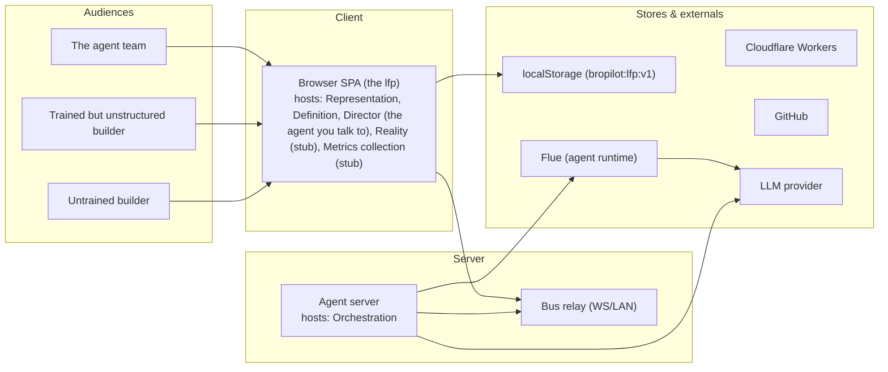
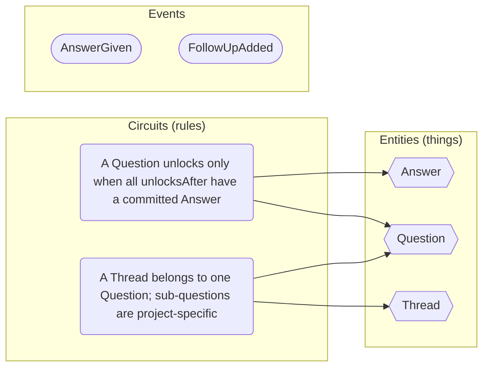
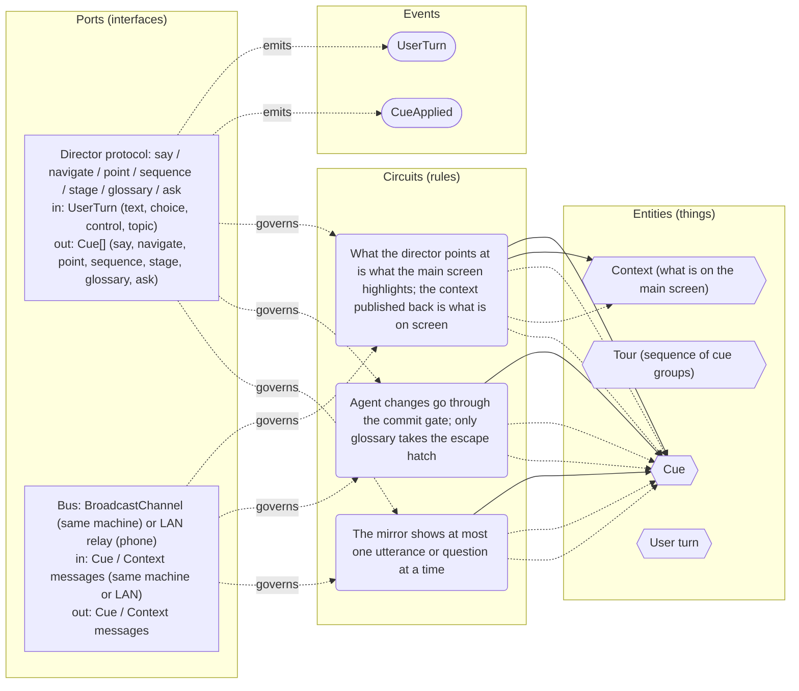
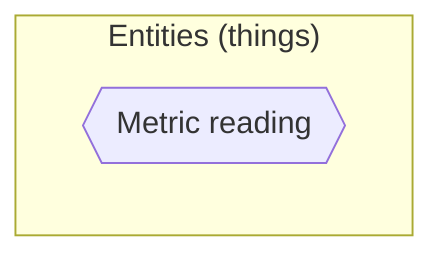
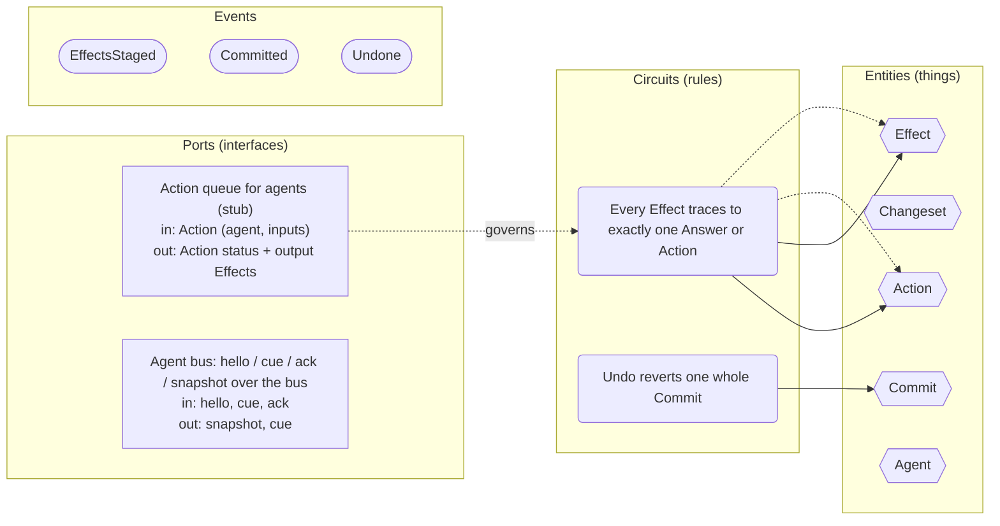
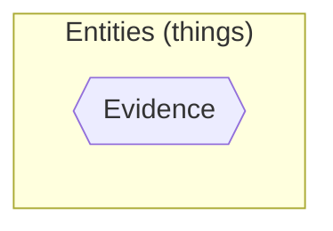
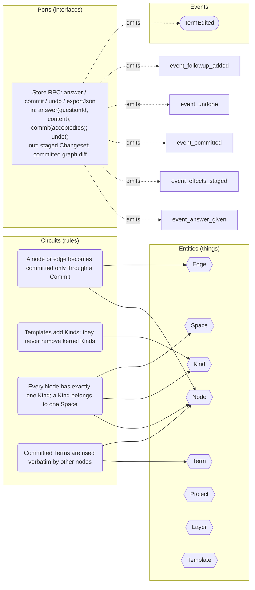

<!-- GENERATED by scripts/emit-docs.mjs — do not edit by hand. Run `npm run docs` to regenerate. -->

# Architecture

## Deployment

The deployables (client, servers, caches, stores, queues) a system runs on, from the user's client device to the servers and back, plus the modules each one hosts.



## Cells

Inside a module: the interface's ports (molecules in/out), circuits through domain entities, the data model behind, events, and the tests that prove the rules. Each points at code.

Circuits are drawn with `carries` (Interface carries a payload that is or derives from this thing ("molecules" entering/leaving through the interface's in/out).), `governs` (Rule governs a thing (or several: relationship rules).) and `emits` (Produces an event (interface or rule emits event).) edges: each interface's circuit is its port, the rules governing the things it carries, those things, and the events it emits.

## Automation (the product automation zone)

Protocols for how we enact the representation: gates, audits, publishing. Reality's practices realise them.

```mermaid
flowchart LR
```

- **Interfaces:** (none)
- **Things:** (none)
- **Rules:** (none)
- **Events:** (none)
- **Tests:** (none)

## Definition

The question tree, answers and threads that grow the representation.



- **Interfaces:** (none)
- **Things:** Question, Answer, Thread
- **Rules:** A Question unlocks only when all unlocksAfter have a committed Answer, A Thread belongs to one Question; sub-questions are project-specific
- **Events:** AnswerGiven, FollowUpAdded
- **Tests:** a question unlocks only after its unlocksAfter are answered

## Delivery & implementation (stub)

A business domain, not a tech one. Same rules: things, rules, tests, interface.

```mermaid
flowchart LR
```

- **Interfaces:** (none)
- **Things:** (none)
- **Rules:** (none)
- **Events:** (none)
- **Tests:** delivery module exists: an onboarding guide is published

## Director (the agent you talk to)

Speaks the Cue protocol to the main screen; scripted tours now, Flue later.



- **Interfaces:** Director protocol: say / navigate / point / sequence / stage / glossary / ask, Bus: BroadcastChannel (same machine) or LAN relay (phone)
- **Things:** Cue, Tour (sequence of cue groups), Context (what is on the main screen), User turn
- **Rules:** The mirror shows at most one utterance or question at a time, Agent changes go through the commit gate; only glossary takes the escape hatch, What the director points at is what the main screen highlights; the context published back is what is on screen
- **Events:** CueApplied, UserTurn
- **Tests:** mirror screen loads and waits for the main screen, a point cue highlights exactly the named cards on the main screen, a stage cue produces a reviewable changeset, nothing committed, the mirror never renders two utterances at once

## Marketing & promotion (stub)

Funnels, leads, content. A business domain module.

```mermaid
flowchart LR
```

- **Interfaces:** (none)
- **Things:** (none)
- **Rules:** (none)
- **Events:** (none)
- **Tests:** marketing module exists: a landing page is live

## Metrics collection (stub)

Turns reality into evidence: metric readings, test counts, verdicts.



- **Interfaces:** (none)
- **Things:** Metric reading
- **Rules:** (none)
- **Events:** (none)
- **Tests:** (none)

## Orchestration

Effects, changesets, commits, actions, agents.



- **Interfaces:** Action queue for agents (stub), Agent bus: hello / cue / ack / snapshot over the bus
- **Things:** Effect, Changeset, Commit, Action, Agent
- **Rules:** Every Effect traces to exactly one Answer or Action, Undo reverts one whole Commit
- **Events:** EffectsStaged, Committed, Undone
- **Tests:** answer() stages one effect per line, nothing becomes committed except through commit(), undo() reverts exactly one commit, simulated random answer/commit/undo sequences never leave a draft committed

## Reality (stub)

Deployed system, usage, evidence. Shape only.



- **Interfaces:** (none)
- **Things:** Evidence
- **Rules:** (none)
- **Events:** (none)
- **Tests:** (none)

## Representation

The graph: nodes, edges, kinds, spaces, glossary. Source of truth.



- **Interfaces:** Store RPC: answer / commit / undo / exportJson
- **Things:** Node, Edge, Kind, Space, Term, Project, Layer, Template
- **Rules:** A node or edge becomes committed only through a Commit, Templates add Kinds; they never remove kernel Kinds, Every Node has exactly one Kind; a Kind belongs to one Space, Committed Terms are used verbatim by other nodes
- **Events:** TermEdited
- **Tests:** lfp page loads and renders the Overview

## Sales (stub)

A business domain, not a tech one. Same rules: things, rules, tests, interface.

```mermaid
flowchart LR
```

- **Interfaces:** (none)
- **Things:** (none)
- **Rules:** (none)
- **Events:** (none)
- **Tests:** sales module exists: a way to buy or book exists

## Invariants

Architecture-relevant invariants from the kernel (see the app's Reference tab for the full list):

- A node or edge becomes committed only through a Commit. Agents never write directly; their output is a changeset.
- Every effect traces to exactly one Answer or one Action.
- Templates can add kinds, edge types, and questions; they cannot remove kernel ones.
- A question unlocks only after all of its unlocksAfter questions have a committed answer.
- Undo reverts one whole Commit, never a partial.
- Spaces are enriched left to right: basics → problem → hypothesis → solution.
- Once a term is committed in the vocabulary, other nodes should use it verbatim.
- Every level-3 item may carry props.codeRef, a URL to the file or block on GitHub that implements it.
- Every rule has at least one test per condition; tests are how the representation connects to reality.
- If every test result is pass, there are no planned changes. Any fail or missing result must be targeted by a task.
- Tests climb a ladder: a basic existence check first, for every module including business ones → its API surface → deterministic simulation.
- Every protocol in the representation is realised by a practice in reality, or its absence is a planned change.
- Modules keep boundaries strict enough to be tested by deterministic simulation.
- Modules, tests and effects cover every aspect of the business — promotion, sales, marketing, delivery, implementation — not just the tech product.
- The mirror shows at most one utterance (or one question) at a time.
- Agent data changes go through the commit gate like everyone else's; only glossary edits take the escape hatch.
- Bropilot must be describable in Bropilot with no special cases.
- Edits are effects too, not just new nodes: an update-node effect goes through the same commit gate as an add-node one.
- Rules exist at the meta level as well as the node level: relations between nodes are governed by kernel rules (edge shape, needs), same as nodes encode domain rules.
- Every edge fits the declared from/to kinds of its edge type.
- A kind's `needs` are structural expectations on its instances: at least `min` edges of the named type and direction.
- A codebase test ties an expectation of the representation to reality: every test verifies a rule.
- The meta level is tested too: where the kernel is not followed, the check raises a question or clarification request for the user, never a silent auto-repair.
- There is one test kind; `resultSource` (code, metric, manual) varies, not the kind.
- Staleness on edit is transitive, with an early cutoff: a neighbour revalidated unchanged clears its edges and stops the spread; a neighbour that was itself edited cascades again.
- A rule's condition is one line of its description text (or its title, if it has none).
- A suspect edge stays surfaced until the node it touches is revalidated.
- A task is done only after its full suite is green and a reviewer agent verdict, not on green tests alone.

_42 kinds, 25 edge types, 4 levels, 28 invariants, 12 kernel questions — see the Reference tab for the live versions._